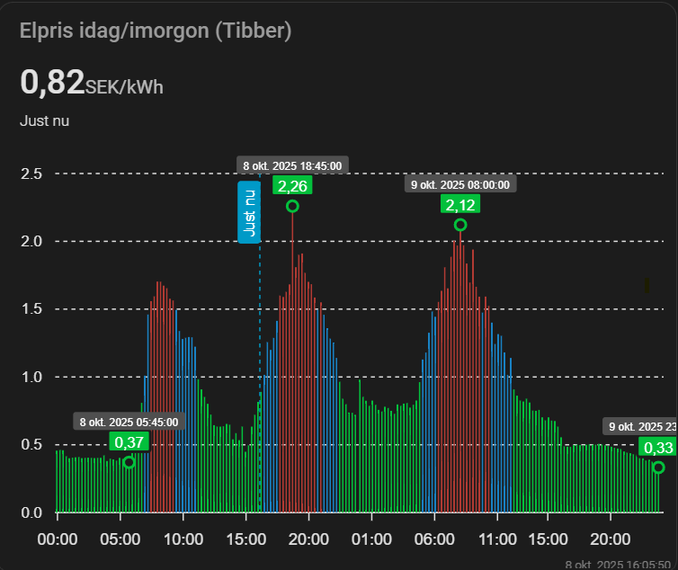
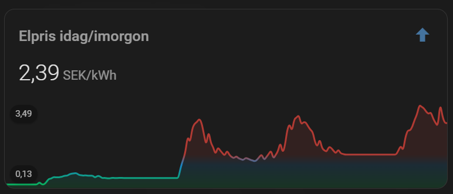

# Tibber Extended för Home Assistant

<p align="center">
  
</p>

En integration som hämtar elpriser och prisnivåer från Tibber's API med avancerade funktioner.

## ✨ Funktioner

- 🔄 Automatisk hämtning av dagens och morgondagens elpriser
- 🪙 **Valbart stöd för underenheter:** Välj själv om du vill se priset i `kr` eller `öre` (eller `EUR` / `ct`). Skalar automatiskt alla attribut!
- 🤖 **Smarta binära automationssensorer:** Färdiga sensorer för billigaste/dyraste timmarna som räknar över midnatt och kan tidsbegränsas. Slut på krånglig YAML-kod!
- 🔘 **Manuell "Refresh"-knapp:** Tvinga fram prisuppdateringar när du vill.
- 📊 Prisnivåer (`VERY_CHEAP`, `CHEAP`, `NORMAL`, `EXPENSIVE`, `VERY_EXPENSIVE`) direkt från Tibber.
- ⏰ Flera konfigurerbara uppdateringstider (t.ex. kl 13:00 och 15:00).
- 🕐 Stöd för `QUARTER_HOURLY` (15 min) eller `HOURLY` (60 min) upplösning.
- 🏠 Anpassningsbara hemnamn och valuta (SEK, NOK, EUR, DKK).
- 🌍 Svenskt och engelskt språkstöd.
- 🔧 Ändra inställningar live utan att installera om.
- 📈 Automatisk beräkning av min/max/medelpris för idag och imorgon.

## 📦 Installation via HACS

### Metod 1: HACS (Rekommenderat)

1. Öppna HACS i Home Assistant
2. Klicka på **"Integrations"**
3. Klicka på de tre prickarna längst upp till höger
4. Välj **"Custom repositories"**
5. Lägg till URL: `https://github.com/adnansarajlic/tibber-extended`
6. Välj kategori: **"Integration"**
7. Klicka **"ADD"**
8. Sök efter **"Tibber Extended"** och installera
9. Starta om Home Assistant

### Metod 2: Manuell Installation

1. Ladda ner senaste release från GitHub
2. Kopiera mappen `custom_components/tibber_extended` till din Home Assistant `config/custom_components` mapp
3. Starta om Home Assistant

## ⚙️ Konfiguration

### 1. Hämta din Tibber API Token (Valfritt)

**OBS:** Du kan använda den inkluderade demo-token för testning, men den kan sluta fungera utan förvarning!

För personlig användning med rätt elområde, hämta din egen token:

1. Gå till [Tibber Developer Portal](https://developer.tibber.com/settings/access-token)
2. Logga in med ditt Tibber-konto
3. Skapa en ny token om den inte redan finns under "Access Token"
4. Kopiera token

### 2. Lägg till Integration

1. Gå till **Inställningar** → **Enheter och tjänster**
2. Klicka på **+ LÄGG TILL INTEGRATION**
3. Sök efter **"Tibber Extended"**
4. Konfigurera:
   - **API Token**: Lämna tomt för demo-token, eller ange din egen
   - **Hemnamn**: T.ex. "Mitt Hem" (används i sensornamn)
   - **Prisupplösning**: QUARTER_HOURLY (15 min) eller HOURLY (60 min)
   - **Valuta**: SEK, NOK, EUR eller DKK
   - **Uppdateringstider**: T.ex. "13:00, 15:00" (kommaseparerade)

**Standardvärden:**
- Demo-token används om inget anges
- Hemnamn: "Mitt Hem"
- Upplösning: QUARTER_HOURLY
- Valuta: SEK
- Uppdateringstider: 13:00 och 15:00

### 🪙 Prisvisning: Kr eller Öre?

Du kan när som helst växla mellan att visa huvudvärdet i basenhet (t.ex. kr) eller underenhet (t.ex. öre). Detta påverkar både huvudenhetens state och alla attribut som rör priser (min, max, medel).

| Inställning | Huvudvärde (State) | Attribut (min / max / avg) |
| :--- | :--- | :--- |
| **Standard** | `0.45 kr/kWh` | `0.45` |
| **Underenheter** | `45.00 öre/kWh` | `45.0` |

---

## 🤖 Smarta Binära Sensorer

Integrationen skapar två binära sensorer per hem som förenklar din automation avsevärt. Dessa sensorer räknar på **all tillgänglig data** (både idag och imorgon) för att hitta det absolut bästa fönstret.

### `binary_sensor.[hem]_best_price`
Slås på under de **N billigaste** sammanhängande timmarna. 
*   **Sömlös midnattsövergång:** Om de billigaste timmarna är kl 23:00 till 02:00 kommer sensorn vara `ON` hela tiden utan avbrott vid midnatt.
*   **Tidsbegränsning (Valfritt):** Du kan ställa in ett tidsfönster (t.ex. 22:00–06:00) i inställningarna. Sensorn kommer då endast söka efter det billigaste priset inom det valda fönstret.

### `binary_sensor.[hem]_peak_price`
Slås på under de **N dyraste** timmarna. Perfekt för att stänga av tunga laster (t.ex. elvärme) när priset är som högst.

---

### Varför flera uppdateringstider?

Tibber publicerar:
- **13:00-14:00**: Morgondagens priser släpps oftast här
- **15:00**: Extra kontroll om priser missades
- **20:00** (valfritt): För att säkerställa senaste data

## 📊 Sensor

Integrationen skapar EN sensor per hem:

### `sensor.[hemnamn]_electricity_price`

**State:** Aktuellt totalpris (kr/kWh eller vald valuta)

**Uppdateras automatiskt:**
- QUARTER_HOURLY: Varje 15:e minut
- HOURLY: Varje timme

**Attribut:**
```json
{
  "current_total": 0.0956,
  "current_energy": 0.0650,
  "current_tax": 0.0306,
  "current_level": "VERY_CHEAP",
  "current_starts_at": "2025-10-06T04:00:00.000+02:00",
  "currency": "SEK",
  "resolution": "QUARTER_HOURLY",
  
  "today": {
    "count": 96,
    "prices": [
      {
        "total": 0.0956,
        "energy": 0.0650,
        "tax": 0.0306,
        "startsAt": "2025-10-06T00:00:00.000+02:00",
        "level": "VERY_CHEAP"
      },
      ...
    ],
    "total": {
      "min": 0.0848,
      "max": 0.6634,
      "avg": 0.1234
    },
    "energy": {
      "min": 0.0548,
      "max": 0.6334,
      "avg": 0.0934
    }
  },
  
  "tomorrow": {
    "count": 96,
    "prices": [...],
    "total": {...},
    "energy": {...}
  }
}
```

---

## ⚙️ Hur det fungerar (Under huven)

För att ge en så stabil upplevelse som möjligt använder Tibber Extended några smarta logiker:

*   **5-sekunders-shiften:** Exakt kl 23:59:55 flyttar integrationen morgondagens priser till "idag" internt. Detta gör att dina grafer och sensorer uppdateras omedelbart vid midnatt utan att behöva vänta på ett segt API-anrop.
*   **12:45-regeln:** Integrationen hämtar endast morgondagens priser efter kl 12:45. Detta görs för att undvika "504 Gateway Timeout"-fel hos Tibber, då sökningarna blir halva storleken fram till dess att morgondagens priser faktiskt finns tillgängliga.
*   **Retry med optimering:** Om Tibber har driftstörningar försöker vi igen med en smart algoritm för att inte överbelasta deras tjänst.

## 🤖 Automatiseringsexempel

### Starta tvättmaskin vid billigt pris

```yaml
alias: "Notifikation: Billigt elpris"
description: ""
triggers:
  - trigger: state
    entity_id:
      - sensor.mitt_hem_electricity_price
    attribute: current_level
    to: VERY_CHEAP
conditions:
  - condition: time
    after: "06:00:00"
    before: "22:00:00"
actions:
  - action: notify.mobile_app_iphone
    metadata: {}
    data:
      title: ⚡ Mycket billigt elpris!
      message: >
        Nu är elpriset {{ states('sensor.mitt_hem_electricity_price') }}
        kr/kWh.  Perfekt tid att starta tvättmaskin eller diskmaskin!

### Starta billaddaren (Det enkla sättet)

Genom att använda de inbyggda binära sensorerna blir dina automationsregler extremt enkla. Ingen template-kod behövs!

```yaml
alias: "Bil: Ladda under billigaste timmarna"
trigger:
  - trigger: state
    entity_id: binary_sensor.mitt_hem_best_price
    to: "on"
actions:
  - action: switch.turn_on
    target:
      entity_id: switch.elbil_laddare
```

### Hitta billigaste 3-timmarsperioden idag

```yaml
template:
  - sensor:
      - name: "Billigaste 3-timmarsperioden"
        state: >
          
          
            
            
            
              
              
                
                
              
            
            
              {{ (as_timestamp(prices[ns.best_start].startsAt) | timestamp_custom('%H:%M')) }}
            
          
            Ej tillgängligt
          
        attributes:
          avg_price: >
            
            
              
              
              
                
                
                  
                  
                
              
              {{ (ns.best_sum / 12) | round(4) }}
            
          end_time: >
            
            
              
              
              
                
                
                  
                  
                
              
              
                {{ (as_timestamp(prices[ns.best_start + 11].startsAt) | timestamp_custom('%H:%M')) }}
              
            
          period_description: >
            
            
              
              
              {% for i in range(0, (prices | length) - 12) %>
                
                
                  
                  
                
              
              
                {{ (as_timestamp(prices[ns.best_start].startsAt) | timestamp_custom('%H:%M')) }} - {{ (as_timestamp(prices[ns.best_start + 11].startsAt) | timestamp_custom('%H:%M')) }}
              
            

```

### Värmepump - Kör under billiga timmar

```yaml
automation:
  - alias: "Värmepump - Boost under billiga timmar"
    trigger:
      - platform: time_pattern
        minutes: "/15"
    condition:
      - condition: numeric_state
        entity_id: sensor.mitt_hem_electricity_price
        below: 0.09  # Under 9 öre/kWh
    action:
      - service: climate.set_temperature
        target:
          entity_id: climate.varmepump
        data:
          temperature: 24

  - alias: "Värmepump - Normal under dyra timmar"
    trigger:
      - platform: time_pattern
        minutes: "/15"
    condition:
      - condition: numeric_state
        entity_id: sensor.mitt_hem_electricity_price
        above: 0.15  # Över 15 öre/kWh
    action:
      - service: climate.set_temperature
        target:
          entity_id: climate.varmepump
        data:
          temperature: 20
```

### Visa priser i HA Price Timeline Card
Integrationen är byggd för att fungera direkt med [ha-price-timeline-card](https://github.com/Neisi/ha-price-timeline-card) utan behov av extra yaml-mallar! Attributet `data` (och aliaset `timeline_data`) exponerar exakt det dataformat som kortet förväntar sig. 

Du kan även koppla in dina binära automationssensorer för att färglägga billiga/dyra timmar direkt i grafen.

```yaml
type: custom:price-timeline-card
price: sensor.mitt_hem_electricity_price
view: graph
slider: true
cheap_times: true
cheap_time_sources:
  - binary_sensor.mitt_hem_best_price
```


### Visa priser i Apexcharts kort



```yaml
type: custom:apexcharts-card
apex_config:
  legend:
    show: false
experimental:
  color_threshold: true
graph_span: 48h
header:
  title: Elpris idag/imorgon (Tibber)
  show: true
  show_states: true
span:
  start: day
now:
  show: true
  label: Just nu
show:
  last_updated: true
series:
  - entity: sensor.mitt_hem_electricity_price
    color_threshold:
      - value: 1.5
        color: "#B13A33"
      - value: 1
        color: "#1982C4FF"
      - value: 0
        color: "#03c03c"
    name: Idag
    type: column
    show:
      extremas: time
      in_header: false
      legend_value: false
    color: "#03c03c"
    float_precision: 2
    data_generator: |
      return entity.attributes.today.prices.map((entry, index) => {
        return [new Date(entry["startsAt"]).getTime(), entry["total"]];
      });
  - entity: sensor.mitt_hem_electricity_price
    color_threshold:
      - value: 1.5
        color: "#B13A33"
      - value: 1
        color: "#1982C4FF"
      - value: 0
        color: "#03c03c"
    name: Imorgon
    type: column
    show:
      extremas: time
      in_header: false
      legend_value: false
    color: "#03c03c"
    float_precision: 2
    data_generator: |
      return entity.attributes.tomorrow.prices.map((entry, index) => {
        return [new Date(entry["startsAt"]).getTime(), entry["total"]];
      });
  - entity: sensor.mitt_hem_electricity_price
    name: Just nu
    type: column
    show:
      in_chart: false
    float_precision: 2
```

### Visa priser i Mini Graph Card

```
type: custom:mini-graph-card
entities:
  - entity: sensor.mitt-hem_electricity_price
    name: Elpris idag/imorgon
    show_state: true
hours_to_show: 48
points_per_hour: 4
line_width: 2
font_size: 75
animate: true
color_thresholds:
  - value: 0
    color: '#03c03c'
  - value: 1.0
    color: '#1982C4'
  - value: 1.4
    color: '#B13A33'
show:
  labels: true
  labels_secondary: false
  points: hover
  legend: true
  icon: true
  name: true
  state: true
```

---

## 🛠 För Utvecklare

### Tester och stabilitet
Vi använder automatiserade enhetstester för att säkerställa att prisberäkningarna och tidsfilter alltid fungerar korrekt.

*   **CI/CD:** Alla ändringar testas automatiskt via GitHub Actions på Python 3.11 och 3.12.
*   **Kör lokalt:** Om du vill bidra kan du köra testerna själv med `python -m pytest tests/`.
*   **Linting:** Vi använder `Ruff` för att hålla koden ren och fri från fel.

## 🤝 Bidra

Bidrag är välkomna! 

- 🐛 Rapportera buggar via [GitHub Issues](https://github.com/adnansarajlic/tibber-extended/issues)
- 💡 Föreslå nya funktioner
- 🔧 Skicka Pull Requests

## 📄 Licens

MIT License - Se [LICENSE](LICENSE) för detaljer

## 🙏 Tack till

- [Tibber](https://tibber.com/) för deras fantastiska API
- Home Assistant-communityn för inspiration och hjälp

## 📞 Support

- **GitHub Issues**: [github.com/adnansarajlic/tibber-extended/issues](https://github.com/adnansarajlic/tibber-extended/issues)
- **Home Assistant Community**: [community.home-assistant.io](https://community.home-assistant.io/)

---

**⚠️ Viktigt:** Denna integration är inte officiellt supporterad av Tibber. Demo-token tillhandahålls för testning men kan sluta fungera.

**🔒 Säkerhet:** Din API-token lagras säkert i Home Assistant's krypterade storage.